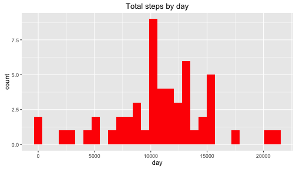
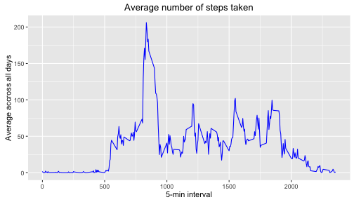
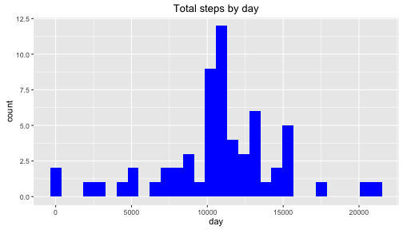
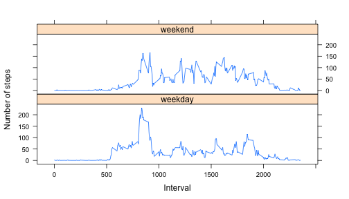

## Loading and Preprocessing the data
- Unzip and Load the data

```r
if(!file.exists("activity.csv")) unzip("activity.zip")
activity <- read.csv("activity.csv")
```
- Process/ transform the data

```r
library(dplyr)
activity <- tbl_df(activity)
activity$date <- as.Date(activity$date)
head(activity)
```

```
## Source: local data frame [6 x 3]
## 
##   steps       date interval
##   (int)     (date)    (int)
## 1    NA 2012-10-01        0
## 2    NA 2012-10-01        5
## 3    NA 2012-10-01       10
## 4    NA 2012-10-01       15
## 5    NA 2012-10-01       20
## 6    NA 2012-10-01       25
```

## What is mean total number of steps taken per day?
- Calculate the total number of steps taken per day

```r
totalsteps <- aggregate(steps ~ date, data = activity, sum, na.rm = TRUE)
head(totalsteps)
```

```
##         date steps
## 1 2012-10-02   126
## 2 2012-10-03 11352
## 3 2012-10-04 12116
## 4 2012-10-05 13294
## 5 2012-10-06 15420
## 6 2012-10-07 11015
```

- Make a histogram of the **total number of steps** taken each day

```r
library(ggplot2)
qplot(totalsteps$steps, geom = "histogram", fill = I("red"), xlab="day", main = "Total steps by day")
```



- Calculate and report the mean and median of the **total number of steps** taken per day
mean

```r
mean(totalsteps$steps)
```

```
## [1] 10766.19
```
median

```r
median(totalsteps$steps)
```

```
## [1] 10765
```

## What is the average daily activity pattern?
- Make a time series plot (i.e. 𝚝𝚢𝚙𝚎 = "𝚕") of the 5-minute interval (x-axis) and the average number of steps taken, averaged across all days (y-axis)

```r
avgsteps <- activity %>% group_by(interval) %>% summarise(avg = mean(steps, na.rm = TRUE))
ggplot(avgsteps, aes(interval, avg)) + geom_line(col = "blue") + xlab("5-min interval") + 
        ylab("Average accross all days") + ggtitle("Average number of steps taken")
```



- Which 5-minute interval, on average across all the days in the dataset, contains the maximum number of steps?

```r
avgsteps[which.max(avgsteps$avg),]$interval
```

```
## [1] 835
```

## Imputing missing values

- Calculate and report the total number of missing values in the dataset (i.e. the total number of rows with 𝙽𝙰s)

```r
sum(is.na(activity))
```

```
## [1] 2304
```

- Devise a strategy for filling in all of the missing values in the dataset. The strategy does not need to be sophisticated. For example, you could use the mean/median for that day, or the mean for that 5-minute interval, etc.
Let's replace NA's by the mean for that 5-minute interval

```r
has.row.na <- apply(activity, 1, function(x){any(is.na(x))})
activity_na <- activity[has.row.na,]
activity_na <- merge(activity_na, avgsteps, by = "interval")
activity_na$steps <- activity_na$avg
activity_na$avg <- NULL
activity_notna <- activity[!has.row.na,]
```

- Create a new dataset that is equal to the original dataset but with the missing data filled in.

```r
activity_complete <- rbind(activity_na, activity_notna)
head(activity_complete)
```

```
##   interval    steps       date
## 1        0 1.716981 2012-10-01
## 2        0 1.716981 2012-11-30
## 3        0 1.716981 2012-11-04
## 4        0 1.716981 2012-11-09
## 5        0 1.716981 2012-11-14
## 6        0 1.716981 2012-11-10
```

- Make a histogram of the total number of steps taken each day and Calculate and report the mean and median total number of steps taken per day. Do these values differ from the estimates from the first part of the assignment? What is the impact of imputing missing data on the estimates of the total daily number of steps?

```r
totalsteps2 <- aggregate(steps ~ date, data = activity_complete, sum, na.rm = TRUE)
qplot(totalsteps2$steps, geom = "histogram", fill = I("blue"), xlab="day", main = "Total steps by day")
```



mean

```r
mean(totalsteps$steps)
```

```
## [1] 10766.19
```

median

```r
median(totalsteps$steps)
```

```
## [1] 10765
```

After replacing the mean is the same but the median is a little bit different

## Are there differences in activity patterns between weekdays and weekends?
- Create a new factor variable in the dataset with two levels – “weekday” and “weekend” indicating whether a given date is a weekday or weekend day.


```r
daylevel <- rep("weekday", length(activity_complete$date))
daylevel[grep("S(un|at)", weekdays(activity_complete$date))] <- "weekend"
activity_complete$daylevel <- factor(daylevel)
stepsbyday <- aggregate(steps ~ interval + daylevel, data = activity_complete, mean)
names(stepsbyday) <- c("interval", "daylevel", "steps")
```

- Make a panel plot containing a time series plot (i.e. 𝚝𝚢𝚙𝚎 = "𝚕") of the 5-minute interval (x-axis) and the average number of steps taken, averaged across all weekday days or weekend days (y-axis). See the README file in the GitHub repository to see an example of what this plot should look like using simulated data.


```r
library(lattice)
xyplot(steps ~ interval | daylevel, stepsbyday, type = "l", layout = c(1, 2), 
    xlab = "Interval", ylab = "Number of steps")
```


